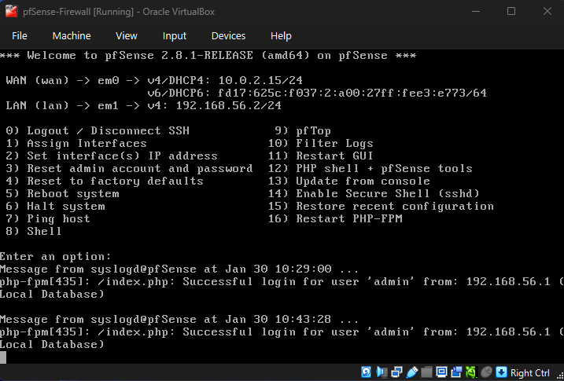

# pfSense Firewall Configuration Project (LAN Policy Hardening)

## Project Overview

This project demonstrates the design and implementation of a basic but controlled LAN firewall policy using **pfSense**.

The goal was to:
- Understand **stateful firewall behavior**
- Apply **least-privilege outbound access**
- Observe how protocol blocking (ICMP) affects real traffic
- Document mistakes, debugging steps, and fixes clearly

This project is intentionally kept simple and transparent to show **fundamental firewall concepts**, not enterprise complexity.

